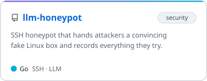
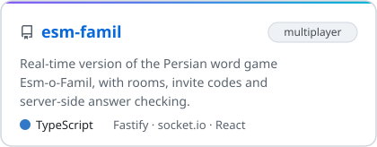
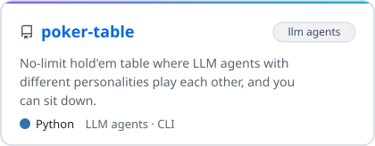
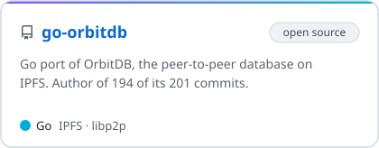
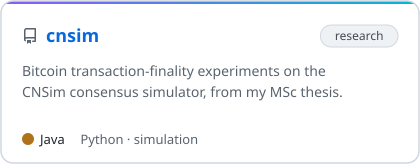
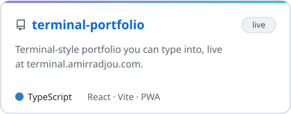

<!-- Header and project cards are generated by tools/build_assets.py -->

<picture>
  <source media="(prefers-color-scheme: dark)" srcset="assets/header-dark.svg">
  
</picture>

  
  
  

<h3 align="center">Projects</h3>

  <a href="https://github.com/amirradjou/llm-honeypot"><picture><source media="(prefers-color-scheme: dark)" srcset="assets/cards/llm-honeypot-dark.svg"></picture></a>
  <a href="https://github.com/amirradjou/esm-famil"><picture><source media="(prefers-color-scheme: dark)" srcset="assets/cards/esm-famil-dark.svg"></picture></a>
  <a href="https://github.com/amirradjou/poker-table"><picture><source media="(prefers-color-scheme: dark)" srcset="assets/cards/poker-table-dark.svg"></picture></a>
  <a href="https://github.com/orbitdb/go-orbitdb"><picture><source media="(prefers-color-scheme: dark)" srcset="assets/cards/go-orbitdb-dark.svg"></picture></a>
  <a href="https://github.com/amirradjou/cnsim"><picture><source media="(prefers-color-scheme: dark)" srcset="assets/cards/cnsim-dark.svg"></picture></a>
  <a href="https://github.com/amirradjou/terminal-portfolio"><picture><source media="(prefers-color-scheme: dark)" srcset="assets/cards/terminal-portfolio-dark.svg"></picture></a>

<h3 align="center">Also on GitHub</h3>

  
  
  
   
  
  
  

<h3 align="center">Tech</h3>

  <picture>
    <source media="(prefers-color-scheme: dark)" srcset="https://skillicons.dev/icons?i=go,py,ts,java,rust,postgres,kubernetes,docker,githubactions,react,linux&theme=dark">
    
  </picture>

